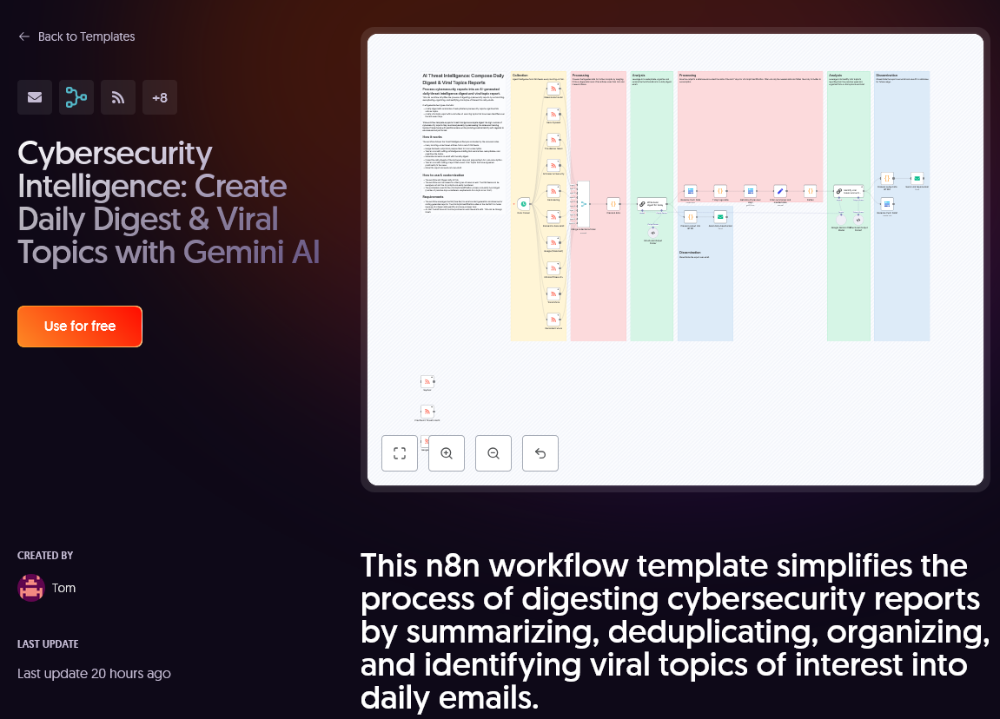
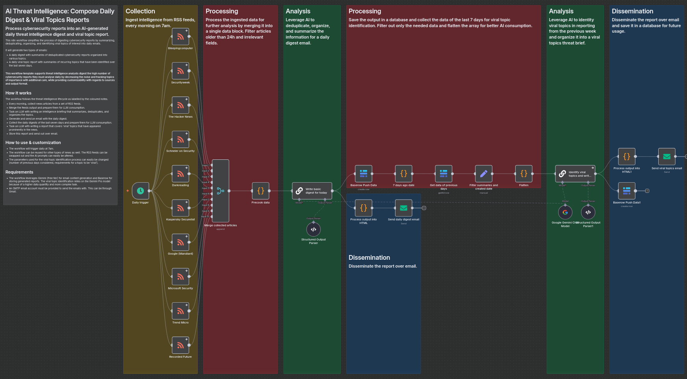
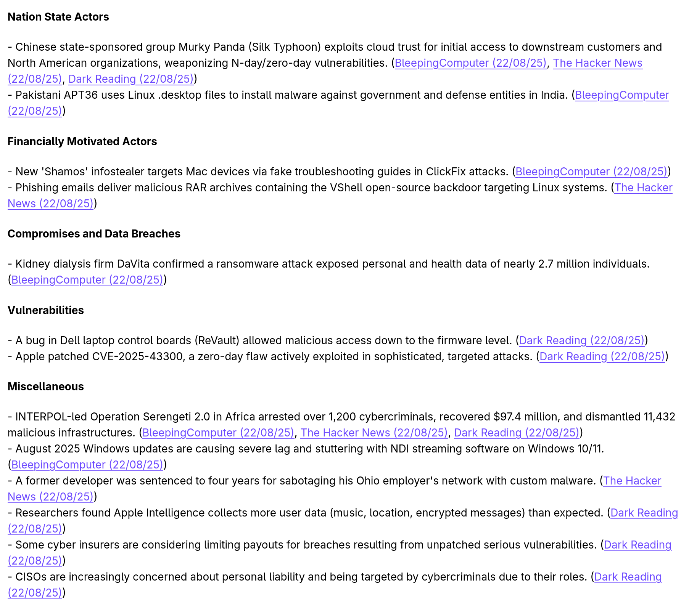
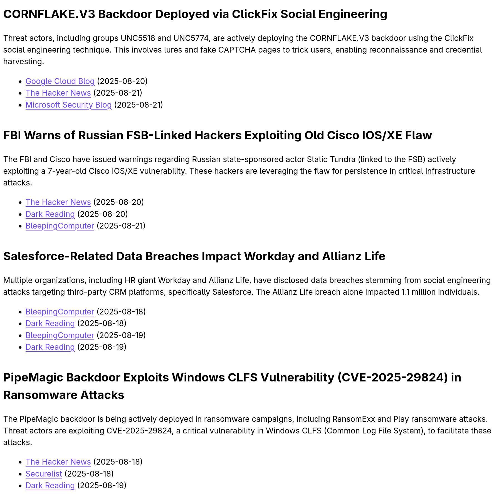

# Automation Workflow: Create Daily Digest & Identify Viral Topics with AI
This page showcases an automation workflow built for the tool [n8n](https://n8n.io/). This n8n workflow template simplifies the process of digesting cybersecurity reports by summarizing, deduplicating, organizing, and identifying viral topics of interest into daily emails.

!!! info
    The workflow was submitted to n8n for review and is available as [template](https://n8n.io/workflows/7608-cybersecurity-intelligence-create-daily-digest-and-viral-topics-with-gemini-ai/). A JSON copy can also be downloaded the repository this information is hosted on under the 'projects' folder.
    

{ align=left }
/// caption
The template was published on the n8n website and can be found [here](https://n8n.io/workflows/7608-cybersecurity-intelligence-create-daily-digest-and-viral-topics-with-gemini-ai/). 
///

## Workflow - AI Threat Intelligence: Compose Daily Digest & Viral Topics Reports

Process cybersecurity reports into an AI-generated daily threat intelligence digest and viral topic report.

{ align=left }
/// caption
A n8n automation workflow for composing daily threat intelligence digest & viral topics reports with AI.
///

This n8n workflow simplifies the process of digesting cybersecurity reports by summarizing, deduplicating, organizing, and identifying viral topics of interest into daily emails. 

It will generate two types of emails:
- A daily digest with summaries of deduplicated cybersecurity reports organized into various topics.
- A daily viral topic report with summaries of recurring topics that have been identified over the last seven days. 

**This workflow template supports threat intelligence analysts digest the high number of cybersecurity reports they must analyse daily by decreasing the noise and tracking topics of importance with additional care, while providing customizability with regards to sources and output format.**

## How it works
The workflow follows the threat intelligence lifecycle as labelled by the coloured notes.
- Every morning, collect news articles from a set of RSS feeds.
- Merge the feeds output and prepare them for LLM consumption.
- Task an LLM with writing an intelligence briefing that summarizes, deduplicates, and organizes the topics.
- Generate and send an email with the daily digest.
- Collect the daily digests of the last seven days and prepare them for LLM consumption.
- Task an LLM with writing a report that covers 'viral' topics that have appeared prominently in the news. 
- Store this report and send out over email.

## How to use & customization
- The workflow will trigger daily at 7am. 
- The workflow can be reused for other types of news as well. The RSS feeds can be swapped out and the AI prompts can easily be altered. 
- The parameters used for the viral topic identification process can easily be changed (number of previous days considered, requirements for a topic to be 'viral').

## Requirements
- The workflow leverages Gemini (free tier) for email content generation and Baserow for storing generated reports. The viral topic identification relies on the Gemini Pro model because of a higher data quantity and more complex task.
- An SMTP email account must be provided to send the emails with. This can be through Gmail. 

## Prompts
The workflow uses two prompts; one for the 'basic' daily digest emails and one for the viral topics report.

!!! example "Prompt 1: daily digest"

    You are an intelligence analyst. Summarize the following threat intelligence articles into a concise, high-signal daily briefing. Do not make things up. Drop items that are not relevant enough. Follow these rules:  

    1. Group information by topic. Use the following sections as guidelines:
        - Nation state actor activity
        - Financially motivated actor activity
        - Compromises and data breach activity (list victims only)
        - Vulnerabilities activity (list with CVEs or affected products, only high priorities)
        - Other miscellaneous activity that is sensible to share. Topics not related to cybersecurity can be disregarded. Ignore ads. Keep it short.
    2. Deduplicate reports. If multiple sources report on the same event, merge them. Prefer brevity over repetition.
    3. Prioritize topics mentioned multiple times. Omit low-signal, one-off articles unless highly critical. Keep lines concise, prioritize readability of the end product over including all content. Topics should typically fit on a single line, having 20 words maximum.
    4. Link all sources found for an item. Deduplicated items should have more than one source.  
    5. Remove all ads, promotional language, or off-topic content.
    6. Use clear, non-speculative language. Avoid filler. 
    7. Put it in well-unified JSON format.

!!! example "Prompt 2: viral topics"

    You are an intelligence analyst reviewing cyber threat intelligence reports from the past x days, formatted in a defined JSON schema. Your task is to identify 'viral' news items that describe the *same topic* and appear across multiple days. When such overlapping topics are found:

    * Merge them into a single entry.
    * Ensure the merged entry is mentioned on multiple across the grouped items.
    * Extract and synthesize a concise *title* and *summary* for the merged topic.
    * Aggregate all associated references under the merged entry.
    * Sort the merged topics based on newest source, descending.

    You may merge items across different categories (e.g., “Nation state actors”, “Vulnerabilities”) if they clearly concern the same underlying event or threat. Do not include or report on any item that does not meet the above threshold. The objective is to surface recurring, high-signal topics for a daily digest, consolidating redundant reports into unified narratives. It is more important to have three well-processed viral topics, than many bad ones.

## Examples
See an example both types of emails below.

{ align=left }
/// caption
Example of a daily digest email.
///

{ align=left }
/// caption
Example of a daily viral topic digest email.
///