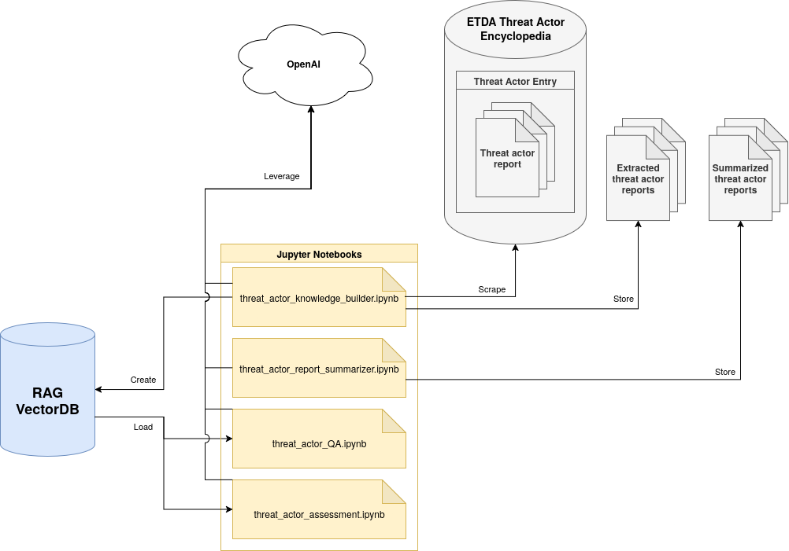

# Generative AI threat intelligence research into RAGS and automated threat actor assessment
This project (see [repository](https://github.com/TomInTheBytes/GenAI-Threat-Intelligence-Research)) explores proof-of-concepts to integrate generative AI with threat intelligence. It is heavily inspired by the excellent [research](https://github.com/OTRF/GenAI-Security-Adventures) of Roberto Rodriguez ([@Cyb3rWard0g](https://github.com/Cyb3rWard0g)). It follows a similar structure with small alterations. It contains various Jupyter Notebooks that explore the different topics. Every notebook is documented and has various improvement ideas. It explores the following areas:

- **Threat Actor RAG:** Building a retrieval-augmented generation (RAG) system using unstructured sources such as the ETDA Cyber Threat Actor Encyclopedia. 
- **Report Summarizer:** Normalizing reports on threat actors by generating concise summaries for further usage by GenAI.
- **Threat Actor Assessment:** Automating evaluations of threat actors’ relevance and risk to organizations using generative models and the threat box framework, aiming for consistency and reduced manual effort.

## Overview
This project contains four Jupyter Notebooks:

- **[threat_actor_knowledge_builder.ipynb:](https://github.com/TomInTheBytes/GenAI-Threat-Intelligence-Research/blob/main/knowledge/threat_actor_knowledge_builder.ipynb)** this notebook demonstrates how to build a threat actor source knowledge vector database based on the ETDA threat actor database and its linked reports. The output can be found in the [GitHub repository](https://github.com/TomInTheBytes/GenAI-Threat-Intelligence-Research/tree/main/knowledge/documents/reports) or on [Huggingface](https://huggingface.co/datasets/TomTheAnalyst/ETDA-Threat-Actors) to skip this step.
- **[threat_actor_report_summarizer.ipynb:](https://github.com/TomInTheBytes/GenAI-Threat-Intelligence-Research/blob/main/knowledge/threat_actor_report_summarizer.ipynb)** this notebook summarizes all threat actor reports that were scraped and combines them into one file per threat actor. The output can be found in the [GitHub repository](https://github.com/TomInTheBytes/GenAI-Threat-Intelligence-Research/tree/main/knowledge/documents/summaries).
- **[threat_actor_QA.ipynb:](https://github.com/TomInTheBytes/GenAI-Threat-Intelligence-Research/blob/main/threat_actor_QA.ipynb)** this notebook demonstrates how to query a vector database in QA fashion using Langchain and OpenAI.
- **[threat_actor_assessment.ipynb:](https://github.com/TomInTheBytes/GenAI-Threat-Intelligence-Research/blob/main/threat_actor_assessment.ipynb)** this notebook experiments with leveraging the threat actor report summaries to assess their threat according to a specific victim profile using the threat box model.

This diagram describes the relationships between the previously mentioned components:

{ align=left }
/// caption
Overview of Jupyter Notbooks.
///

## Threat Actor RAG
Retrieval Augmented Generation (RAG) is a method to retrieve context relevant for a chatbot prompt from a vector database. This way you can build a knowledge base and not be dependant on the LLMs context coverage and timeliness. You also have influence on what information the chatbot should work with and can prevent hallucinations. For more information see [this](https://blog.openthreatresearch.com/demystifying-generative-ai-a-security-researchers-notes/) great summary.

@Cyb3rWard0g already experimented with using MITRE's threat actor database as knowledge for a RAG. This database contains very structured and consistent documents. I was curious to see how other, less controlled threat actor information sources would perform. I decided to do a simple scrape of the [ETDA Threat Actor Encyclopedia](https://apt.etda.or.th/cgi-bin/aptgroups.cgi). This database contains over 450 threat actors and provides various hyperlinks to reports about operations and information about these threat actors. See "threat-actor-knowledge-builder.ipynb" and "threat-actor-QA.ipynb" for the experiment.

## Report Summarizer
The scraped reports vary in quality, length, and consistency. By summarizing them through an LLM we can iron out some of these issues. The summaries can also provide additional input for multi vector retrievers. This notebook describes how to loop over the reports and create summaries for reports where we can. It leverages OpenAI's API and deals with token limits.

## Threat Actor Assessment
As an organization you want to prioritize your resources through threat intelligence. By assessing threat actors for their threat level to your organization you can look at their TTPs to learn and prepare for. However, threat actor assessment can take a lot of effort through manual work, especially when kept up to date. It is also difficult to be consistent on the analysis through time and different analysts. Generative AI could support this process by assessing reports through some model. By leveraging the [threat box](https://klrgrz.medium.com/quantifying-threat-actors-with-threat-box-e6b641109b11) model this notebook experiments with assessing threat actors through LLMs.

