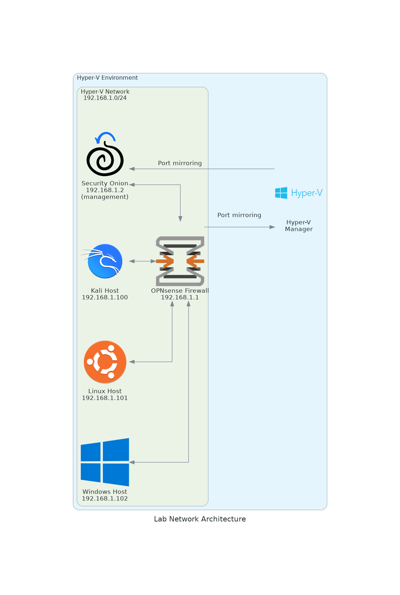
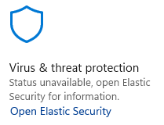

# Lab Architecture
This page describes the virtual machines that are part of the lab environment and how they are interconnected. The VMs are hosted on a desktop PC through Hyper-V. All VMs are forced to use a static IP; DHCP is turned off at the router level.


{ align=left }
/// caption
Security lab network architecture.
///

## Routing: OPNsense
*[OPNsense](https://opnsense.org/) is an open source, feature rich firewall and routing platform, offering cutting-edge network protection.*

OPNsense is used as router VM as it is free to use, has a wide range of features, and is open-source. The installation uses `OPNsense-25.1`. The `.img` was converted to `.vhdx` to work with Hyper-v using the following command:

``` bash
qemu-img convert -f raw -O vhdx <INPUT_IMAGE.img> <OUTPUT_IMAGE.vhdx>
```

The VM is allocated two network adapters in Hyper-v to accommodate both a local network for the lab and internet access for the VMs (WAN & LAN). These are created under `Virtual Switch Manager' in the Hyper-V settings for the host system:

- **LAB - WAN Switch:** connection type to external network to provide internet access.
- **LAB - LAN Switch:** connection type to private network to create network between VMs. 

DHCP was turned off to force clients to have a static IP. 

## Security infrastructure: Security Onion
Security Onion was installed in [standalone configuration](https://docs.securityonion.net/en/2.4/configuration.html#production-server-standalone). It connects to the OPNsense router through both its management interface (`192.168.1.2`) and port mirroring interface. The virtual LAN switch is assigned to the OPNsense VM as 'Source' and to the Security Onion VM as 'Destination' under Advanced Features in Hyper-V for port mirroring. This ensures that all network traffic that is flowing over the Lab LAN network is shared to Security Onion for further analysis. 

## Endpoint: Windows Host
A Windows VM is used as an endpoint to simulate attacks and generate logs on. It is a Windows evaluation VM (WinDev2407). It was given static IP `192.168.1.102`. Elastic Agent was [installed](https://docs.securityonion.net/en/2.4/elastic-agent.html) to forward Windows logs and trigger on Elastic alerts (replacing MDE) through the Elastic Fleet manager in Security Onion. Sysmon was [installed](https://github.com/trustedsec/SysmonCommunityGuide/blob/master/chapters/install_windows.md) using a highly expressive [configuration](https://github.com/Neo23x0/sysmon-config/blob/master/sysmonconfig-trace.xml) to gather additional logs for investigation.

!!! info "Replace MDE with Elastic Defend"
    You can replace Microsoft Defender for Endpoint with Elastic Defend as antivirus solution after deploying the agent by doing the following in Kibana:

    `Elastic Kibana -> Security (sidebar) -> Manage -> Policies -> choose policy -> scroll to bottom and select 'Enabled' under 'Register as antivirus'`

    { align=left }
    /// caption
    The Windows security settings should display this after the change.
    ///


## Endpoint: Ubuntu
TBD

## Endpoint: Kali
TBD