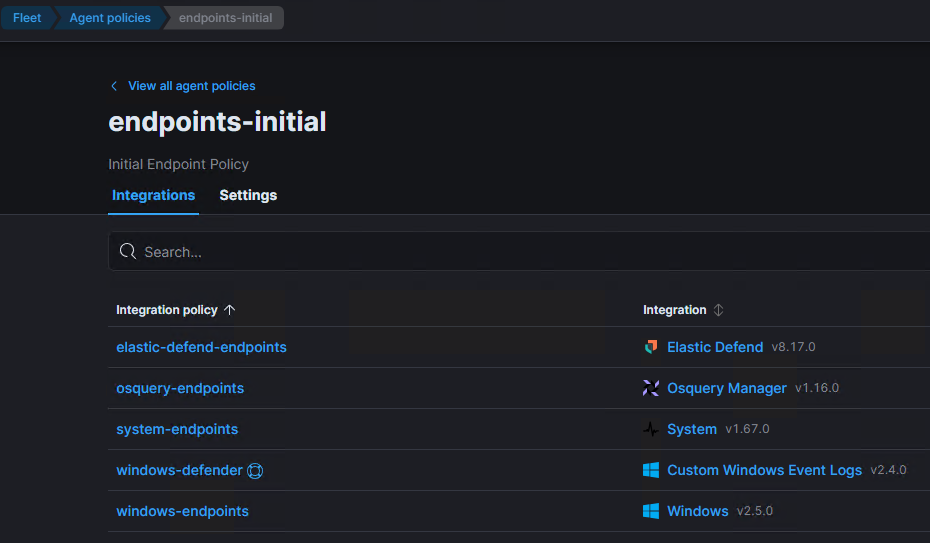

# Security Onion
## Introduction
*[Security Onion](https://docs.securityonion.net/en/2.4/introduction.html) is a free and open platform built by defenders for defenders. It includes network visibility, host visibility, intrusion detection honeypots, log management, and case management.*

*For network visibility, we offer signature based detection via Suricata, rich protocol metadata and file extraction using either Zeek or Suricata, full packet capture using either Stenographer or Suricata, and file analysis. For host visibility, we offer the Elastic Agent which provides data collection, live queries via osquery, and centralized management using Elastic Fleet. Intrusion detection honeypots based on OpenCanary can be added to your deployment for even more enterprise visibility. All of these logs flow into Elasticsearch and we’ve built our own user interfaces for alerts, dashboards, threat hunting, case management, and grid management.*

## Visibility
This section describes the various visibility sources Security Onion integrates with. It will cover both host and network visibility.

Security Onion integrates the ELK stack (Elasticsearch, Logstash, Kibana) as its core log management and analysis layer. **Logstash** ingests and normalizes logs and network events from sensors, parsers, and other monitoring components within Security Onion. It applies filters and enrichments to make disparate log formats uniform. **Elasticsearch** stores the processed data as indexed documents, enabling rapid searching and correlation across large volumes of network, host, and security logs. **Kibana** provides the visualization and query interface, giving analysts dashboards for intrusion detection alerts, full packet capture metadata, endpoint logs, and system telemetry. **Together, this stack supports Security Onion’s role as a SIEM: collection, normalization, storage, search, correlation, and visualization of security events**.

Elastic also provides an agent that is deployed on endpoints to forward logs and serve as EDR solution to generate alerts. It replaces some of the functionality that Filebeat previously offered and can forward Sysmon logs. 

### Host visibility
The endpoints in the network are used for experimentation into detection use cases. Therefore, they should forward as many logs as possible to Security Onion for further analysis into [host visibility](https://docs.securityonion.net/en/2.4/host.html). This is achieved through deploying [Elastic Agents](https://docs.securityonion.net/en/2.4/elastic-agent.html#elastic-agent), which function both as a log forwarder and alerting engine. This is managed through the [Elastic Fleet](https://docs.securityonion.net/en/2.4/elastic-fleet.html).

#### Elastic Agent
With Elastic Agent you can collect all forms of data from anywhere with a single unified agent per host. One thing to install, configure, and scale. The Elastic Fleet is deploying an Elastic Agent policy named `endpoints-initial` to the endpoints. Agent policies dictate what data each agent will ingest and forward to Elasticsearch. This could be through the use of an HTTP, log file, or TCP-based input. The selected policy includes the following integrations:

{ align=left }
/// caption
Integrations included in the Elastic Agent policy `endpoints-initial` for endpoints.
///

!!! info
    These integrations include the following data:

    - **elastic-defend-endpoints:** this is Elastic's EDR-like integration with an alerting engine and both free and paid features. However, it is not setup to replace Windows Defender as EDR as we want to ingest as many logs and alerts as possible and therefore not block any activity on the endpoints. It captures events on Windows (API, DLL and Driver Load, DNS, File, Network, Process, Registry, Security), MacOS (File, Process, Network), and Linux (File, Process, Network). 
    - **osquery-endpoints:** this allows analysts to query information on the system directly through live or scheduled queries. It does not provide logs on a continuous basis.
    - **system-endpoints:** this collects logs from System instances and Windows Events (Application, Security, and System).
    - **windows-defender:** this collects custom Windows Event (Operational) logs. This integration was added manually. 
    - **windows-endpoints:** this collects logs from the channels ForwardedEvents, Powershell, Microsoft-Windows-Powershell/Operational, and Microsoft-Windows-Sysmon/Operational.

#### Sysmon
*[System Monitor (Sysmon)](https://docs.securityonion.net/en/2.4/sysmon.html) is a Windows system service and device driver that, once installed on a system, remains resident across system reboots to monitor and log system activity to the Windows event log. It provides detailed information about process creations, network connections, and changes to file creation time. By collecting the events it generates using Windows Event Collection or SIEM agents and subsequently analyzing them, you can identify malicious or anomalous activity and understand how intruders and malware operate on your network.*

Sysmon is deployed on Windows hosts in the network following [these instructions](https://github.com/trustedsec/SysmonCommunityGuide/blob/master/chapters/install_windows.md). It is using the [highly verbose configuration](https://github.com/Neo23x0/sysmon-config/blob/master/sysmonconfig-trace.xml) made by Roberto Rodrigues (@Cyb3rWard0g) to ingest as many logs as possible.

### Network visibility
Security Onion offers [network visibility](https://docs.securityonion.net/en/2.4/network.html) on various levels, ranging from metadata to full packet capture. Additionally, it provides automated captures file analysis. 

#### Zeek
*[Zeek](https://docs.securityonion.net/en/2.4/zeek.html) is a powerful network analysis framework that is much different from the typical IDS you may know. (Zeek is the new name for the long-established Bro system. Note that parts of the system retain the “Bro” name, and it also often appears in the documentation and distributions.)*

Zeek captures a wide range of network metadata, including specific protocols such as DNS, HTTP, SSL. It can also extract files.

#### Suricata
*[Suricata](https://docs.securityonion.net/en/2.4/suricata.html#suricata) is a free and open source, mature, fast and robust network threat detection engine. Suricata inspects the network traffic using a powerful and extensive rules and signature language, and has powerful Lua scripting support for detection of complex threats.*

Suricata functions as a network intrusion detection system (NIDS).

#### Strelka
*[Strelka](https://docs.securityonion.net/en/2.4/strelka.html#strelka) is a real-time file scanning system used for threat hunting, threat detection, and incident response. Based on the design established by Lockheed Martin’s Laika BOSS and similar projects (see: related projects), Strelka’s purpose is to perform file extraction and metadata collection at huge scale.*

Strelka will automatically analyze files extracted by Zeek and Suricata. Alerts can be generated based on this analysis.

## Security Information and Event Management (SIEM)
Accessible through Elastic Kibana. 

### Analytics

### Elastic Defend
*[Elastic Defend](https://www.elastic.co/docs/reference/integrations/endpoint) provides organizations with prevention, detection, and response capabilities with deep visibility for EPP, EDR, SIEM, and Security Analytics use cases across Windows, macOS, and Linux operating systems running on both traditional endpoints and public cloud environments.*

The out-of-the-box configuration of Elastic Defend only enables about 25 alerts. We enabled all 1260 to have full coverage.

